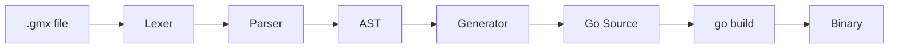

# GMX — Go + HTMX Transpiler Framework

**Write components. Compile to Go. Ship a binary.**

GMX is a full-stack language that compiles to Go, designed for building HTMX-powered web applications with type safety, automatic CSRF protection, and zero runtime dependencies.

## What is GMX?

GMX is a declarative language that combines models, business logic, and templates into a single `.gmx` file. The compiler generates production-ready Go code with GORM for database access, HTMX for dynamic interactions, and built-in security features.

**One file. One command. One binary.**

## Quick Example

```gmx
model Task {
  id:    uuid    @pk @default(uuid_v4)
  title: string  @min(3) @max(255)
  done:  bool    @default(false)
}

<script>
func toggleTask(id: uuid) error {
  let task = try Task.find(id)
  task.done = !task.done
  try task.save()
  return render(task)
}
</script>

<template>
<li id="task-{{.ID}}">
  <input type="checkbox" {{if .Done}}checked{{end}}
    hx-patch="{{route "toggleTask"}}?id={{.ID}}"
    hx-target="#task-{{.ID}}"
    hx-swap="outerHTML" />
  <span>{{.Title}}</span>
</li>
</template>
```

**Compiles to:**

```bash
gmx todo.gmx main.go
go run main.go
# → Full-featured web server with SQLite, CSRF protection, HTMX handlers
```

## Key Features

### Type-Safe HTMX

Route references are validated at compile time. No more broken HTMX attributes.

```gmx
{{route "toggleTask"}}  ✅ Compile-time check
{{route "nonExistent"}} ❌ Compilation error
```

### Automatic CSRF Protection

Double-submit cookie pattern with zero configuration. POST/PATCH/DELETE requests are automatically protected.

```go
// Generated automatically:
// - CSRF cookie on GET
// - Token validation on POST/PATCH/DELETE
// - HTMX header injection
```

### Multi-Tenant by Default

Use `@scoped` annotation for automatic tenant isolation:

```gmx
model Post {
  tenantId: uuid @scoped
  title:    string
}
```

All queries are automatically scoped to the current tenant.

### Single Binary Deployment

The generated Go code compiles to a standalone binary with embedded templates and SQLite support.

```bash
go build -o app main.go
./app  # Ready to deploy
```

## How It Works



1. **Lexer** tokenizes the `.gmx` source
2. **Parser** builds an Abstract Syntax Tree
3. **Script Transpiler** converts GMX Script to Go
4. **Generator** produces complete Go code
5. **Go Compiler** creates the final binary

## Get Started

Check out the [Getting Started Guide](guide/getting-started.md) to build your first GMX application.

## Documentation

### For Users

- **[Getting Started](guide/getting-started.md)** — Installation and first app
- **[Components](guide/components.md)** — Structure of .gmx files
- **[Models](guide/models.md)** — Database models and validation
- **[Script](guide/script.md)** — GMX Script language reference
- **[Templates](guide/templates.md)** — HTML templates with HTMX
- **[Services](guide/services.md)** — External service integration
- **[Security](guide/security.md)** — Built-in security features

### For Contributors

- **[Architecture](contributing/architecture.md)** — Compiler pipeline overview
- **[AST](contributing/ast.md)** — Abstract Syntax Tree types
- **[Lexer & Parser](contributing/lexer-parser.md)** — Tokenization and parsing
- **[Generator](contributing/generator.md)** — Code generation internals
- **[Script Transpiler](contributing/script-transpiler.md)** — GMX Script → Go
- **[Testing](contributing/testing.md)** — Test strategy and coverage

## Status

GMX is currently in **active development**. The compiler is functional with 81% test coverage. See the [AUDIT_REPORT.md](https://github.com/kolapsis/gmx/blob/main/AUDIT_REPORT.md) for detailed analysis.

**Production Readiness:**
- ✅ Prototype/POC ready
- 🟡 Refactoring recommended before scale-up
- 🔴 Security hardening required for public deployment

## License

[MIT License](https://github.com/kolapsis/gmx/blob/main/LICENSE)
